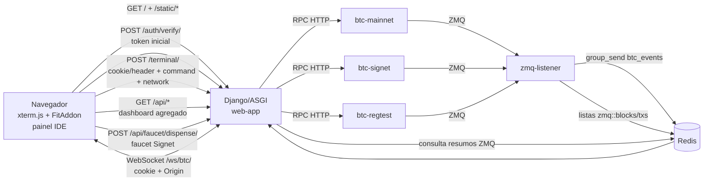

# Arquitetura

## Objetivo

O coreCraft Multi-Node e um painel local para operar e observar tres nodes Bitcoin Core: `mainnet`, `signet` e `regtest`. A interface permite executar RPC por rede, acompanhar sincronizacao, divergencia, mempool e atividade ZMQ, acionar uma faucet controlada em Signet e receber eventos em tempo real via WebSocket.

## Componentes

## Servicos

| Servico | Papel |
| --- | --- |
| `btc-mainnet` | Node Bitcoin Core de mainnet, pruned, usado para observabilidade/RPC. |
| `btc-signet` | Node Bitcoin Core de signet para testes publicos. |
| `btc-regtest` | Node Bitcoin Core local para mineracao e testes controlados. |
| `redis` | Channel layer do Django Channels e memoria curta de eventos ZMQ recentes. |
| `web-app` | Django/ASGI, terminal RPC, APIs agregadas do dashboard e WebSocket. |
| `zmq-listener` | Ponte ZMQ -> Redis/Channels, com persistencia curta de blocos/transacoes observados. |

## Camadas

### Frontend

`templates/index.html` contem o shell do painel e inclui componentes HTML de `templates/components/`. A experiencia visual foi separada em `static/css/panel.css` como agregador e em arquivos menores dentro de `static/css/panel/`. xterm.js e FitAddon sao servidos localmente por `static/js/vendor/` e `static/css/vendor/`. O comportamento fica em `static/js/panel/main.js`, `state.js`, `ui.js`, `terminal.js` e `api.js`, cobrindo estado compartilhado, inicializacao xterm.js/FitAddon, historico por rede, macros, faucet Signet, WebSocket, polling de APIs agregadas e filtro de `help` por categoria.

### Backend HTTP

`core/views.py` valida o login em `/auth/verify/`, grava cookie `HttpOnly`, recebe comandos de `/terminal/` e expoe endpoints `/api/*` para o dashboard. Comandos livres continuam delegados para `core.rpc`; os endpoints agregados combinam RPC e Redis para entregar lag de sincronizacao, resumo de mempool, atividade ZMQ e comparacao entre melhor bloco RPC e ultimo bloco observado pelo listener. Os endpoints `/api/faucet/balance/` e `/api/faucet/dispense/` operam a wallet Signet `corecraft_faucet` com valor fixo e destino gerado no backend.

### Backend ASGI/WebSocket

`core/asgi.py` roteia HTTP para Django e WebSocket para `BTCEventConsumer`, que valida cookie/token e Origin antes de entregar eventos publicados no grupo `btc_events`.

### Listener ZMQ

`core/zmq_listener.py` assina topicos ZMQ por rede conforme `ZMQ_MAINNET_TOPICS`, `ZMQ_SIGNET_TOPICS` e `ZMQ_REGTEST_TOPICS`. Por padrao, `mainnet` e `signet` usam `rawblock,hashblock`, enquanto `regtest` tambem assina `rawtx`. Quando recebe `hashblock`, grava um resumo em Redis, tenta enriquecer o evento com `getblockheader` e `getblockstats` e publica no WebSocket. Quando recebe `rawtx`, grava uma janela curta de txids e horarios em Redis.

## Limites Atuais

- A autenticacao atual usa token compartilhado com cookie `HttpOnly`, nao usuarios individuais.
- `bitcoin.conf` real e local/ignorado; mantenha apenas `bitcoin.conf.example` versionado.
- O frontend ainda e vanilla HTML/CSS/JS, mas ja esta separado em template, CSS, JS estaticos e vendors locais.
- A faucet Signet depende da wallet local `corecraft_faucet` existir e ter saldo; ela nao substitui uma faucet publica.
