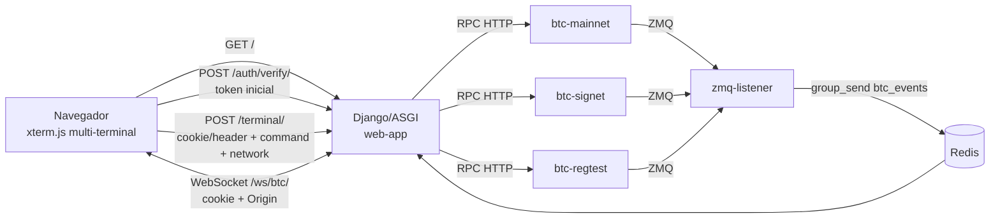

# Arquitetura

## Objetivo

O coreCraft Multi-Node e um painel local para operar e observar tres nodes Bitcoin Core: `mainnet`, `signet` e `regtest`. A interface permite executar RPC por rede, acompanhar sincronizacao/mempool e receber eventos ZMQ em tempo real via WebSocket.

## Componentes

## Servicos

| Servico | Papel |
| --- | --- |
| `btc-mainnet` | Node Bitcoin Core de mainnet, pruned, usado para observabilidade/RPC. |
| `btc-signet` | Node Bitcoin Core de signet para testes publicos. |
| `btc-regtest` | Node Bitcoin Core local para mineracao e testes controlados. |
| `redis` | Channel layer do Django Channels. |
| `web-app` | Django/ASGI, terminal RPC, dashboard e WebSocket. |
| `zmq-listener` | Ponte ZMQ -> Redis/Channels. |

## Camadas

### Frontend

`templates/index.html` concentra a experiencia visual: seletor de rede, tres instancias xterm.js, historico por rede, macros, dashboard e feed de blocos.

### Backend HTTP

`core/views.py` valida o login em `/auth/verify/`, grava cookie `HttpOnly` e recebe comandos de `/terminal/`, delegando parsing/politica/chamada RPC para `core.rpc`.

### Backend ASGI/WebSocket

`core/asgi.py` roteia HTTP para Django e WebSocket para `BTCEventConsumer`, que valida cookie/token e Origin antes de entregar eventos publicados no grupo `btc_events`.

### Listener ZMQ

`core/zmq_listener.py` assina `rawtx`, `rawblock` e `hashblock` nas tres redes. Quando recebe `hashblock`, tenta enriquecer o evento com `getblockheader` e `getblockstats`.

## Limites Atuais

- A autenticacao atual usa token compartilhado com cookie `HttpOnly`, nao usuarios individuais.
- `bitcoin.conf` real e local/ignorado; mantenha apenas `bitcoin.conf.example` versionado.
- O frontend ainda esta em um unico arquivo HTML/CSS/JS.
