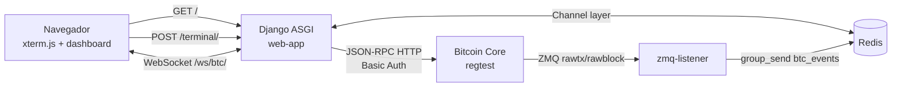

# Arquitetura

## Objetivo

O Bitcoin Regtest Terminal e um command center local para um node Bitcoin Core em `regtest`. A aplicacao permite executar comandos RPC pelo navegador e acompanhar eventos de mempool/blocos em tempo real.

## Componentes

## Servicos Docker

| Servico | Responsabilidade |
| --- | --- |
| `bitcoind` | Executa Bitcoin Core em `regtest`, expoe RPC e publica eventos ZMQ. |
| `redis` | Armazena o channel layer usado pelo Django Channels. |
| `web-app` | Serve HTML, endpoint RPC HTTP e WebSocket via ASGI/Daphne. |
| `zmq-listener` | Assina topicos ZMQ do Bitcoin Core e publica eventos para WebSocket. |

## Camadas

### Frontend

`templates/index.html` renderiza:

- terminal xterm.js;
- botoes de macros;
- dashboard de mempool;
- feed lateral de blocos confirmados;
- cliente WebSocket para `/ws/btc/`.

### Backend HTTP

`core/views.py` recebe comandos textuais, converte parametros simples e encaminha chamadas JSON-RPC para `http://bitcoind:18443`.

### Backend ASGI/WebSocket

`core/asgi.py` roteia HTTP para Django e WebSocket para `BTCEventConsumer`. O consumer entra no grupo `btc_events` e envia ao navegador os dados publicados pelo listener ZMQ.

### Eventos ZMQ

`core/zmq_listener.py` conecta nas portas `28332` e `28333`, assina `rawtx` e `rawblock`, extrai metadados do evento e publica no channel layer.

## Decisoes de Design

- `regtest` permite mineracao local e experimentos sem valor financeiro real.
- JSON-RPC permanece central para comandos administrativos do node.
- WebSocket e usado apenas para eventos assincronos; comandos continuam via HTTP.
- Redis desacopla o processo listener do processo web.
- O listener envia metadados de tamanho, topico e sequencia; ele nao decodifica transacoes ou blocos.

## Limites Atuais

- Nao ha autenticacao de usuario na interface.
- Nao ha banco de dados nem persistencia de historico.
- O parser de comandos separa parametros por espaco e entende apenas inteiros positivos e booleanos simples.
- A chamada RPC nao define timeout.
- O frontend carrega xterm.js por CDN.
