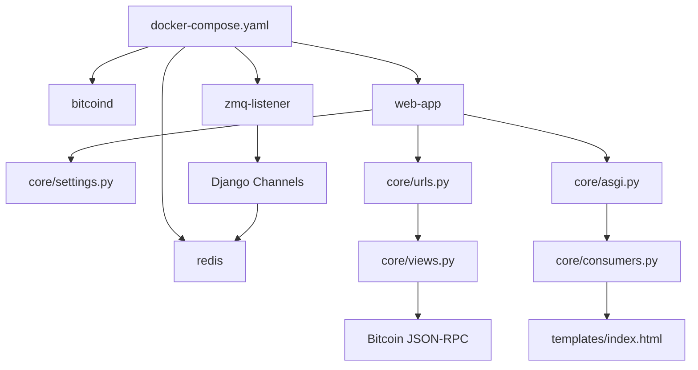

# Mapa do Codigo

Este documento consolida a estrutura, funcoes, classes, contratos e pontos de extensao do codigo.

## Contratos HTTP e WebSocket

### `GET /`

Renderiza a interface web.

Resposta: HTML.

### `POST /terminal/`

Entrada:

```json
{
  "command": "getblockchaininfo"
}
```

Saida:

```json
{
  "result": {},
  "error": null,
  "id": "django"
}
```

O conteudo de `result` depende do metodo RPC chamado.

### `WebSocket /ws/btc/`

Entrega eventos produzidos pelo listener ZMQ.

Payload:

```json
{
  "topic": "rawtx",
  "size": 250,
  "sequence": 10
}
```

## Funcoes e Classes Python

### `manage.main()`

Configura `DJANGO_SETTINGS_MODULE=core.settings` e delega comandos ao Django.

### `views.coerce_rpc_param(value)`

Converte tokens digitados no terminal:

| Token | Valor JSON |
| --- | --- |
| `1` | inteiro `1` |
| `true` | booleano `true` |
| `false` | booleano `false` |
| `abc` | string `"abc"` |

Limitacoes: nao interpreta floats, numeros negativos, arrays, objetos JSON ou aspas com espacos.

### `views.parse_terminal_command(command)`

Separa o primeiro token como metodo RPC e os demais como parametros.

```python
parse_terminal_command("generatetoaddress 1 bcrt1...")
# ("generatetoaddress", [1, "bcrt1..."])
```

Linha vazia:

```python
(None, [])
```

### `views.rpc_call(method, params=None)`

Monta payload JSON-RPC e executa `requests.post` com Basic Auth.

```json
{
  "jsonrpc": "2.0",
  "id": "django",
  "method": "getblockcount",
  "params": []
}
```

### `views.index(request)`

Renderiza `templates/index.html`.

### `views.terminal_command(request)`

Fluxo:

1. Aceita apenas `POST`.
2. Lê `request.body` como JSON.
3. Extrai `command`.
4. Chama `parse_terminal_command`.
5. Executa `rpc_call`.
6. Retorna a resposta do Bitcoin Core.

### `BTCEventConsumer`

Classe em `core/consumers.py`.

- `connect()`: adiciona o canal ao grupo `btc_events`.
- `disconnect(close_code)`: remove o canal do grupo.
- `btc_message(event)`: envia `event["data"]` ao cliente WebSocket.

### `zmq_listener.start_zmq()`

Processo bloqueante que:

1. Cria contexto e socket `zmq.SUB`.
2. Conecta em `tcp://bitcoind:28332` e `tcp://bitcoind:28333`.
3. Assina `rawtx` e `rawblock`.
4. Recebe mensagens multipart `topic`, `payload`, `seq`.
5. Converte `seq` de little-endian para inteiro.
6. Publica dados no grupo `btc_events`.

## Codigo JavaScript

### WebSocket

```javascript
const socket = new WebSocket('ws://' + window.location.host + '/ws/btc/');
```

Ao receber mensagem:

- `rawblock`: imprime evento verde no terminal e adiciona item no feed lateral.
- `rawtx`: imprime evento amarelo no terminal.

### `processCommand(cmd, silent = false)`

Envia o comando para `/terminal/`. Quando `silent` e falso, imprime resposta no xterm.js; quando verdadeiro, retorna os dados para uso por macros.

### `executeMacro(cmd)`

Escreve o comando no terminal e chama `processCommand`.

### `mineBlockMacro()`

Executa `getnewaddress`, usa o endereco retornado e chama `generatetoaddress 1 <endereco>`.

### `fetchMempoolState()`

Consulta `getmempoolinfo` a cada 3 segundos e atualiza os cards.

### `updateDashboardValue(elementId, newValue)`

Atualiza valores do dashboard e aplica destaque visual temporario.

## Dependencias Entre Modulos



## Pontos de Extensao

- Mover `RPC_URL`, `RPC_USER` e `RPC_PASS` para variaveis de ambiente.
- Usar `REDIS_URL` do ambiente em vez de host fixo em `settings.py`.
- Adicionar timeout e tratamento de excecoes em `rpc_call`.
- Implementar parser de comandos com suporte a JSON, aspas e floats.
- Decodificar `rawtx` e `rawblock` em vez de enviar apenas metadados.
- Persistir historico de blocos/eventos se a aplicacao precisar de replay.
- Servir xterm.js localmente.
- Adicionar autenticacao na interface.
- Criar testes unitarios para parser, views, consumer e listener.

## Riscos Conhecidos

- Endpoint `/terminal/` esta sem CSRF.
- Credenciais RPC estao fixas no codigo.
- `ALLOWED_HOSTS=['*']` e `DEBUG=True` sao apropriados apenas para laboratorio.
- Sem banco de dados, todo estado visual e volatil.
- O listener ZMQ nao tem mecanismo de reconnect/backoff explicito.
- O frontend assume `ws://`; em HTTPS seria necessario usar `wss://`.
