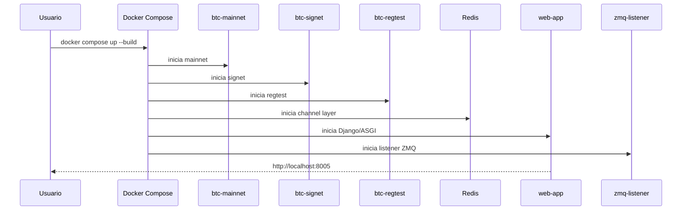
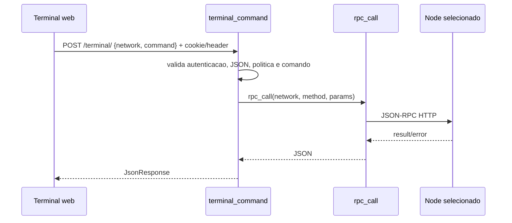
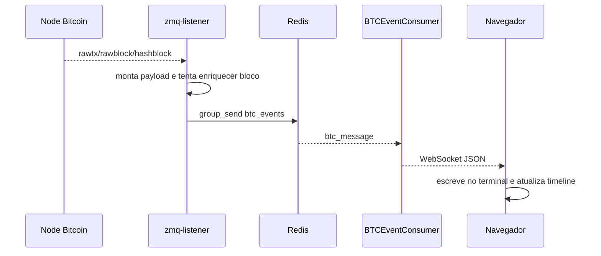

# Fluxos do Sistema

## 1. Inicializacao



## 2. Carregamento da Interface

1. O navegador acessa `GET /`.
2. `core.urls` chama `views.index`.
3. `templates/index.html` cria tres terminais: mainnet, signet e regtest.
4. Se `REQUIRE_AUTH=True`, o navegador solicita `APP_AUTH_TOKEN`.
5. `POST /auth/verify/` valida o token e grava cookie `HttpOnly`.
6. O frontend abre WebSocket em `/ws/btc/`.
7. `BTCEventConsumer` valida cookie/token e Origin, depois registra a conexao no grupo `btc_events`.

Para limpar a sessao, `POST /auth/logout/` remove o cookie e o navegador pode recarregar a tela de login.

## 3. Comando RPC



## 4. Dashboard

O frontend roda `fetchNodeStatus()` a cada 3 segundos:

1. chama `getblockchaininfo`;
2. atualiza progresso/blocos e tamanho em disco;
3. chama `getmempoolinfo`;
4. atualiza taxas acumuladas.

## 5. Eventos ZMQ



Payload tipico:

```json
{
  "network": "regtest",
  "topic": "block_rich",
  "size": 1234,
  "sequence": 42,
  "height": 42,
  "tx_count": 1,
  "fees": 0
}
```

## 6. Macro de Mineracao

Disponivel apenas para `regtest`:

1. executa `getnewaddress`;
2. executa `generatetoaddress 1 <endereco>`;
3. aguarda evento ZMQ;
4. atualiza terminal e timeline.
