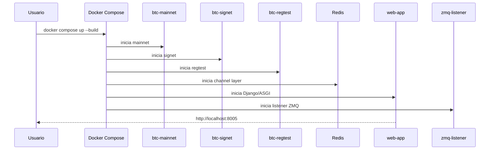
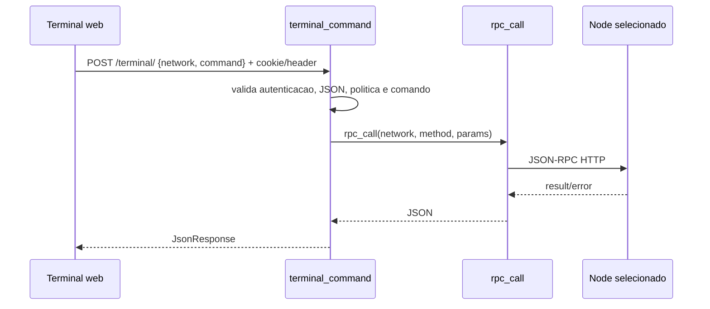
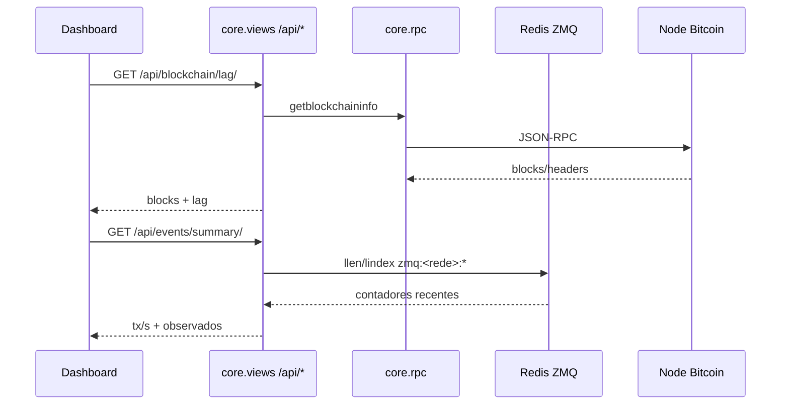
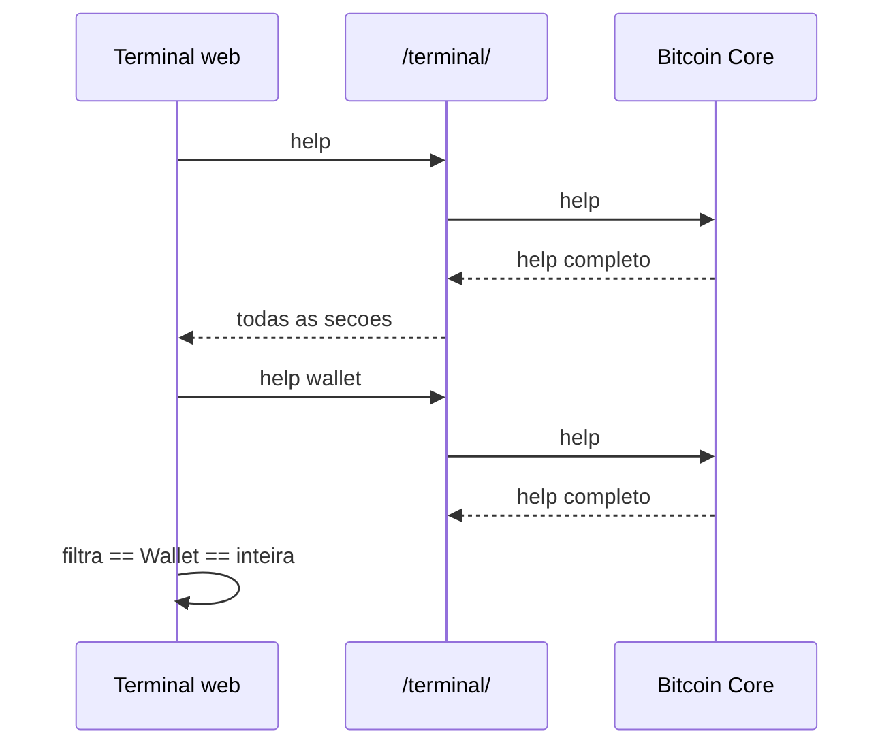
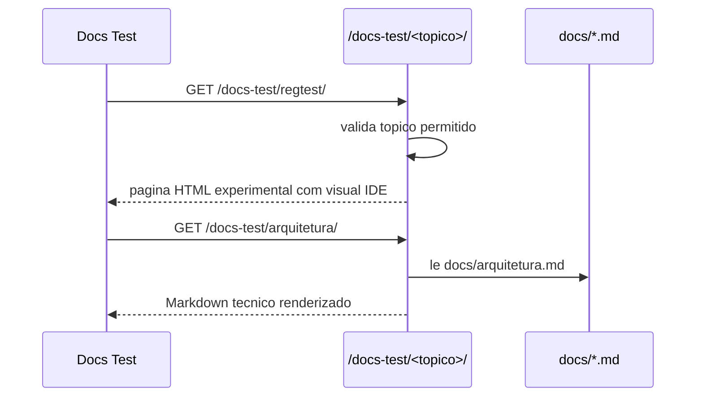
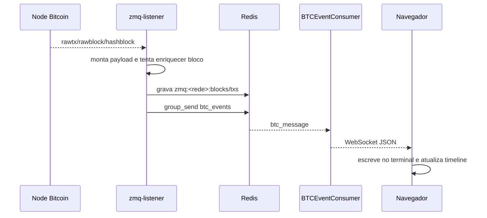
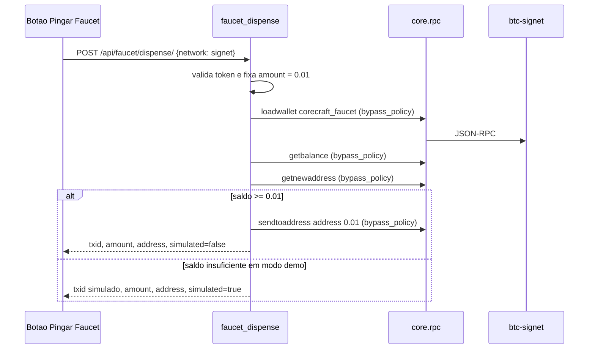

# Fluxos do Sistema

## 1. Inicializacao



## 2. Carregamento da Interface

1. O navegador acessa `GET /`.
2. `core.urls` chama `views.index`.
3. `templates/index.html` monta o shell do painel e inclui os componentes de `templates/components/`.
4. `static/css/panel.css` importa os estilos segmentados em `static/css/panel/`.
5. `static/js/panel/main.js` importa `state.js`, `ui.js`, `terminal.js` e `api.js`.
6. `initTerminals()` cria tres terminais: mainnet, signet e regtest.
7. Se `REQUIRE_AUTH=True`, o navegador solicita `APP_AUTH_TOKEN`.
8. `POST /auth/verify/` valida o token e grava cookie `HttpOnly`.
9. O frontend abre WebSocket em `/ws/btc/`.
10. `BTCEventConsumer` valida cookie/token e Origin, depois registra a conexao no grupo `btc_events`.

Para limpar a sessao, `POST /auth/logout/` remove o cookie e o navegador pode recarregar a tela de login.

## 3. Comando RPC



## 4. Dashboard

O frontend roda `fetchNodeStatus()` com intervalo controlado de 15 segundos:

1. chama `/api/blockchain/lag/` para atualizar blocos, headers/lag, IBD e progresso de verificacao;
2. chama `/api/mempool/summary/` para calcular total de transacoes, fee media em sat/vB e distribuicao low/medium/high;
3. chama `/api/events/summary/` para mostrar tx/s, txs vistas e blocos vistos pelo listener ZMQ;
4. chama `/api/events/state-comparison/` para indicar divergencia entre `getbestblockhash` e ultimo bloco ZMQ registrado;
5. em `signet`, chama `/api/faucet/balance/` para atualizar o badge da faucet;
6. evita chamadas sobrepostas com uma trava de concorrencia;
7. aplica backoff temporario quando uma API agregada falha.

No backend, `core.views` combina chamadas RPC e leituras Redis para montar os
resumos. `core.rpc` continua cacheando chamadas read-only repetidas e erros
temporarios, protegendo o Bitcoin Core quando abas antigas do painel continuam
abertas ou quando `mainnet` esta sincronizando/pruned.



## 5. Help do Terminal



`help <categoria>` funciona para as categorias expostas pelo Bitcoin Core, como `blockchain`, `control`, `mining`, `network`, `rawtransactions`, `signer`, `util`, `wallet` e `zmq`. Quando o argumento nao e uma categoria, o painel tenta tratar como ajuda especifica de comando, por exemplo `help getblock`.

## 6. Prototipo de Docs



As rotas principais `/docs/*` estao desativadas. Topicos `painel`, `mainnet`, `signet` e `regtest` existem apenas no prototipo `/docs-test/*`, enquanto `arquitetura`, `comandos`, `fluxos` e `operacao` reaproveitam arquivos Markdown versionados.

## 7. Eventos ZMQ



Payload tipico:

```json
{
  "network": "regtest",
  "topic": "block_rich",
  "size": 1234,
  "sequence": 42,
  "height": 42,
  "tx_count": 1,
  "fees": 0
}
```

## 8. Macro de Mineracao

Disponivel apenas para `regtest`:

1. executa `getnewaddress`;
2. executa `generatetoaddress 1 <endereco>`;
3. aguarda evento ZMQ;
4. atualiza terminal e timeline.

## 9. Faucet Signet

Disponivel apenas quando a rede ativa e `signet`:



A API nao recebe valor nem endereco arbitrario do navegador. O backend gera o
destino e usa valor fixo. Se a wallet `corecraft_faucet` nao existir, retorna
erro. Se a wallet existir mas estiver sem saldo suficiente, o modo demo retorna
um TXID simulado para preservar a apresentacao; esse retorno nao e uma
transacao publicada na Signet.
