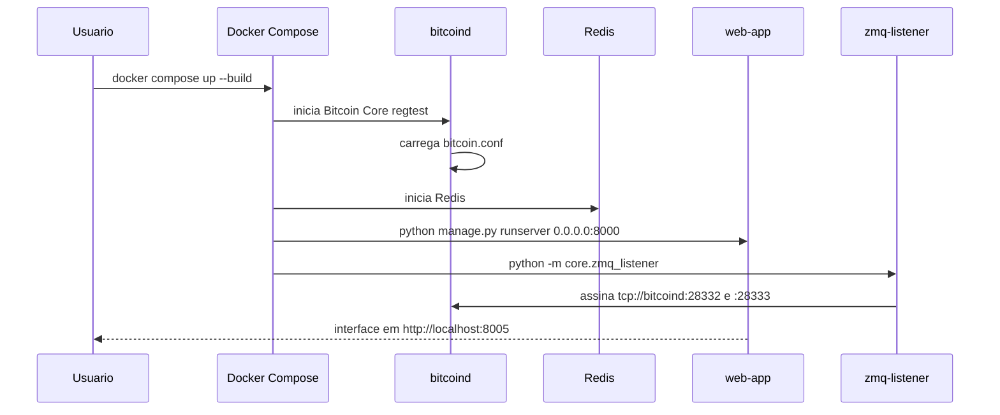
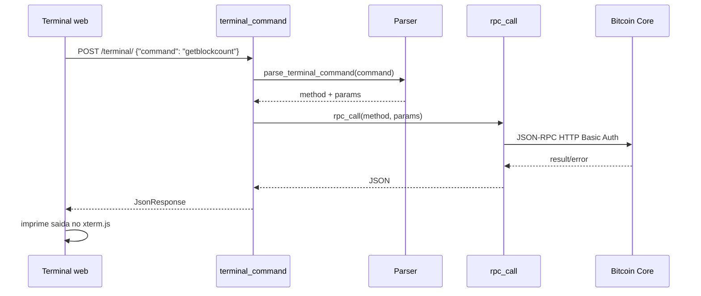
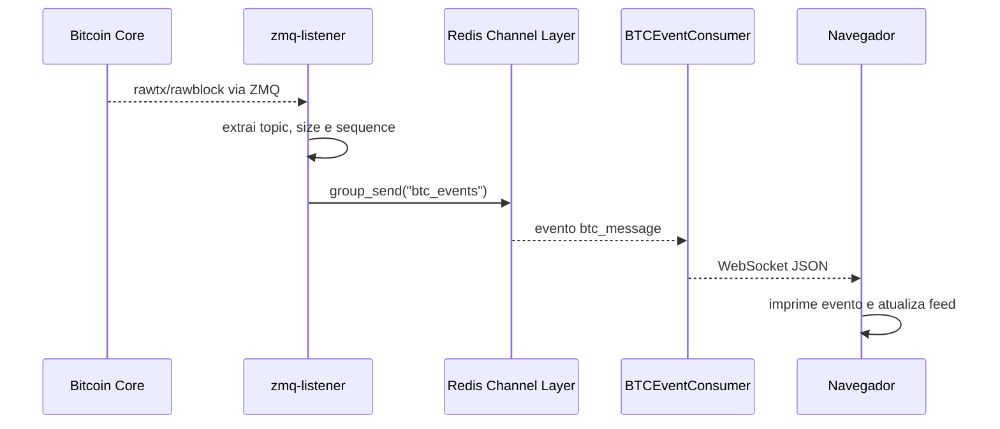

# Fluxos do Sistema

## 1. Inicializacao



## 2. Carregamento da Interface

1. O navegador faz `GET /`.
2. `core.urls` direciona para `views.index`.
3. `views.index` renderiza `templates/index.html`.
4. O HTML inicializa xterm.js, botoes de macro, dashboard e WebSocket.
5. O WebSocket conecta em `/ws/btc/`.
6. O consumer registra a conexao no grupo `btc_events`.

## 3. Comando RPC pelo Terminal



Exemplo:

```text
generatetoaddress 1 bcrt1...
```

Vira:

```json
{
  "jsonrpc": "2.0",
  "id": "django",
  "method": "generatetoaddress",
  "params": [1, "bcrt1..."]
}
```

## 4. Dashboard de Mempool

1. A cada 3 segundos, o frontend chama `fetchMempoolState`.
2. A funcao envia `getmempoolinfo` para `POST /terminal/`.
3. O backend consulta o Bitcoin Core via RPC.
4. O frontend atualiza:
   - quantidade de transacoes;
   - tamanho total em bytes;
   - taxas acumuladas.

## 5. Eventos em Tempo Real



Payload enviado ao frontend:

```json
{
  "topic": "rawblock",
  "size": 1234,
  "sequence": 42
}
```

## 6. Macro "Forjar 1 Bloco"

1. O usuario clica no botao de macro.
2. O frontend executa `getnewaddress` em modo silencioso.
3. Se receber um endereco, executa `generatetoaddress 1 <endereco>`.
4. O Bitcoin Core minera o bloco em regtest.
5. O ZMQ publica `rawblock`.
6. O WebSocket entrega o evento.
7. O feed lateral adiciona o novo bloco.

## 7. Tratamento de Erros

- Linha vazia retorna `{"error": "No command"}`.
- Metodo HTTP diferente de POST em `/terminal/` retorna `405`.
- Erros RPC sao exibidos como `[RPC ERROR]`.
- Falhas de comunicacao entre frontend e backend sao exibidas como `[SYSTEM ERROR]`.
- Falhas internas do listener ZMQ ainda nao possuem retry/backoff explicito.
